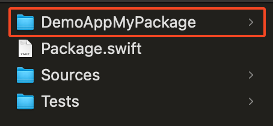
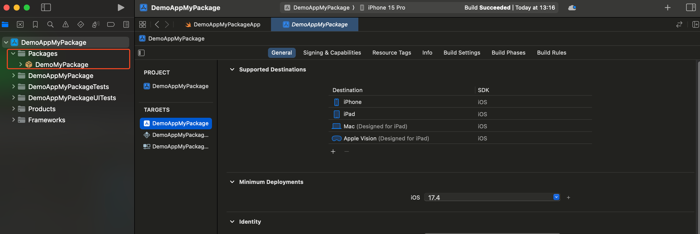
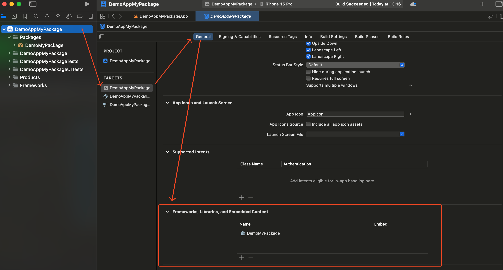

## How to Create a Swift Package with a Demo Project

Creating a Swift package and integrating it into a demo project is an excellent way to modularize your code and test it in a real-world context before sharing it with others. This guide will walk you through setting up your package and integrating it with a demo project.

### 1. Create Your Package

Begin by creating a new directory for your Swift package. Open your terminal and run the following commands. In this example, we will create a package named `MySwiftPackage`:

```bash
mkdir MySwiftPackage
cd MySwiftPackage
swift package init --type library
```

This will create a new folder named `MySwiftPackage` and set up the initial structure of your package.

### 2. Create a Demo Project

Next, open Xcode and create a new Xcode project within the root directory of your Swift package. This project will serve as a demo application that utilizes your Swift package. For example, you might name the project `DemoAppMyPackage`. Your package folder should look like this:



### 3. Add Your Package to the Demo Project

To integrate your Swift package into the demo project, follow these steps:

1. Open your demo app Xcode project and create a new folder named `Packages` within the project navigator.
2. **Drag and drop** your Swift package folder into the `Packages` folder.



### 4. Configure Target Settings

After adding the package, you need to configure the target settings to ensure that your package is properly linked:

1. Select the project file in Xcode, and navigate to the “**General**” tab.
2. Under “**Frameworks, Libraries, and Embedded Content**,” click the “+” button and add your Swift package.



### Conclusion

You’ve now successfully created a Swift package and integrated it with a demo project. This setup allows you to test and develop your package in the context of a real application, making it easier to ensure that everything works as expected.